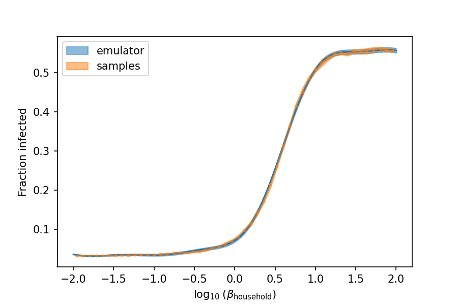

# Gaussian Process Emulation

We can use Gaussian Processes as a powerful regression technique that helps us scan the parameter space in a very efficient way.

The code package we use is [GPyTorch](https://gpytorch.ai/). The first step we need to do is generate samples for the training.

## 1. Generating samples

To configure the `SampleGenerator` class, we need to specify which parameters to vary, within which range, the number of samples per parameter, and the total number of parameters. An example of a configuration file can be found in `configs/sample_generator.yaml` :

```yaml
n_samples: 50
n_samples_per_parameter: 10
parameters_to_vary:
  infection_networks.networks.household.log_beta: [-2,2]

june_configuration_file: "./configs/june_config.yaml"
save_path: "./data/samples.pkl"

```

Which can then be run using the script `scripts/generate_samples.py` like this:

```bash
python generate_samples.py configs/sample_generator.yaml
```

The parameter `n_samples` specifies the number of parameters to sample from the latin hyper-cube, while `n_samples_per_parameter` specifies how many repetitions of a single parameter to make. The results that are stored correspond to the mean and standard deviation of this set of repetitions. 

The `parameters_to_vary` section describes what parameter to range and within which range. Note that only interval ranges are currently supported, since we do the sampling from a latin hyper-cube. It is important that the name of the parameters correspond to the path to the specific parameter in the source code, following PyTorch convention for naming model parameters. All parameters that are not specified will be fixed to the values specified in the `june_configuration_file`.

Finally, the samples will be saved as a pickle file in `save_path`. The pickle file contains a dictionary with 3 fields:

```python
import pickle
samples_dictionary = pickle.load(open("./data/samples.pkl", "rb"))
samples_dictionary.keys() # returns ["parameters", "means", "stds"]
```

The samples dictionary contains the parameters varied and the means and standard deviations obtained for those parameters. We currently only support emulating the number of cases per time-step but this will change.

## 2. Training the emulator

Once we have a `samples.pkl` file, we can setup the emulators for training. We train two emulators per data point: one emulates the mean of the value of interested and the other one emulates the standard deviation. The goal is for the latter to capture the stochastic of the model correctly.

An example of a configuration file for the emulator training can be found in `configs/emulator.yaml`:

```yaml
title: Emulator example configuration file.

device: "cuda:0"

june_configuration_file: "/home/arnau/code/torch_june_inference/configs/june_config.yaml"

emulator_configuration:
  time_stamps: [-1]
  save_path: "data/emulator.pkl"
  samples_path: "/home/arnau/code/torch_june_inference/data/samples.pkl"

```

The `device` parameter allows us to specify the device to use, either CPU or GPU. The `june_configuration_file` is the baseline configuration for June, so all non-varying parameters can be fixed. In the `emulator_configuration` section, we can specify which `time_stamps` of the time series to emulate, where to save our  trained emulator, and the path to the generated samples. The emulator can then be trained doing

```bash
python scripts/train_emulator.py configs/emulator.yaml
```

Once the emulator is trained, we can load it as

```python
import pickle
emulator = pickle.load(open("./data/emulator.pkl"))
```

And we can compare the predictions to the samples doing:

```python
import gpytorch

emulator.set_eval() # put emulator in evaluation mode

emulator_means = []
emulator_stds = []
param_range = torch.linspace(-2, 2, 100).to(device)
for param in param_range:
    with torch.no_grad(), gpytorch.settings.fast_pred_var():
        pp = param.reshape(1,-1)
        res = emulator(pp)
    emulator_means.append(res["means"].item())
    emulator_stds.append(res["stds"].item())
emulator_means = np.array(emulator_means)
emulator_stds = np.array(emulator_stds)
```




