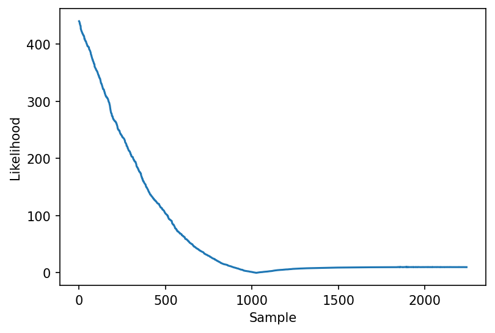
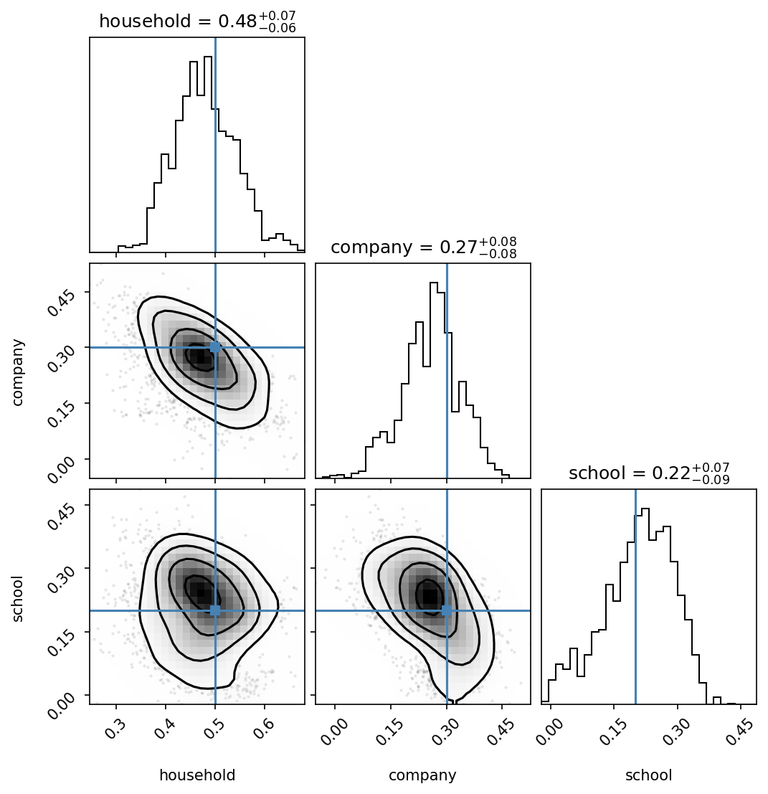
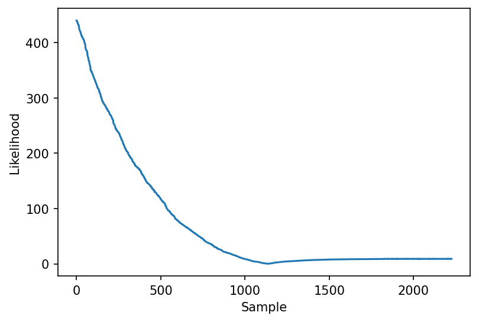
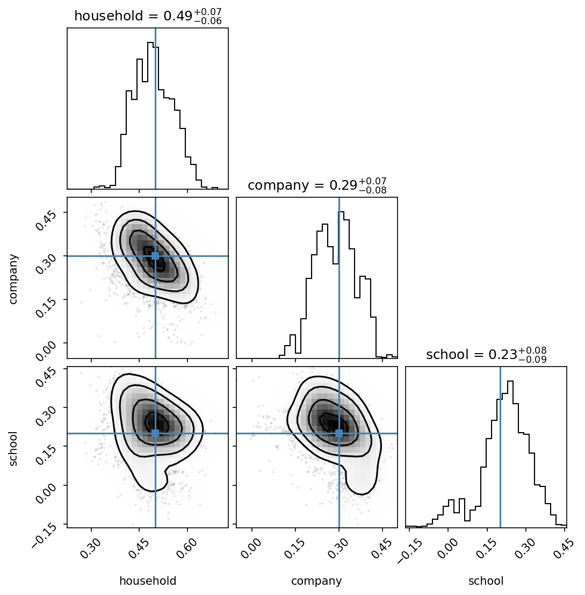

# MultiNest

[MultiNest](https://arxiv.org/abs/0809.3437) is a nested sampling algorithm. The main advantages is that it supports multiprocessing, so if we have a few GPUs available it can be a very suitable option for inference.

The package we use is [PyMultinest](https://github.com/JohannesBuchner/PyMultiNest).

The example configuration file can be found in `configs/multinest.yaml` :

```yaml
title: MultiNest example configuration file.

device: "cuda:0"
june_configuration_file: "/home/arnau/code/torch_june_inference/configs/june_config.yaml"

results_path: "./test_multinest"

parameters_to_fit:
  infection_networks.networks.household.log_beta:
    prior:
      dist: Normal
      loc: 0.3
      scale: 0.1
  infection_networks.networks.company.log_beta:
    prior:
      dist: Normal
      loc: 0.1
      scale: 0.1

data:
  observed_data: "./june_example/results.csv"
  observable: 
    cases_per_timestep:
      time_stamps: [-1]
      error: 0.002

emulator:
  use_emulator: false
  emulator_path: "./data/emulator.pkl"

inference_configuration:
  likelihood: Normal
```

Which follows the same conventions as the [HMC]("./hmc.md") section.

Similarly to the HMC section, we can choose to use an emulator or not. 

To plot the results, we can do:

```python
prefix = "../test_multinest/multinest"
parameters = ["household", "company", "school"]
n_params = len(parameters)
likelihood = np.abs(np.loadtxt(prefix + ".txt")[:,1])
plt.plot(likelihood)
plt.show()
```




```python
lp = np.loadtxt(prefix + ".txt")[:,2:]
weights = np.loadtxt(prefix + ".txt")[:,0]

names = [param.split("_")[-1] for param in parameters]
f = corner.corner(lp, labels = names, smooth=2, truths=true_values, weights=weights, show_titles=True, bins=30)

```





