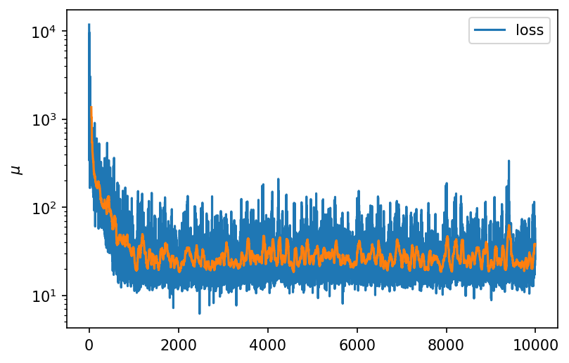
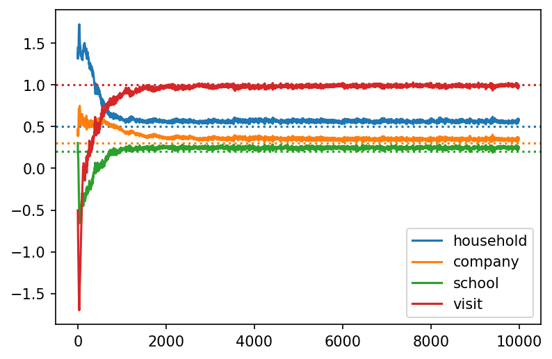
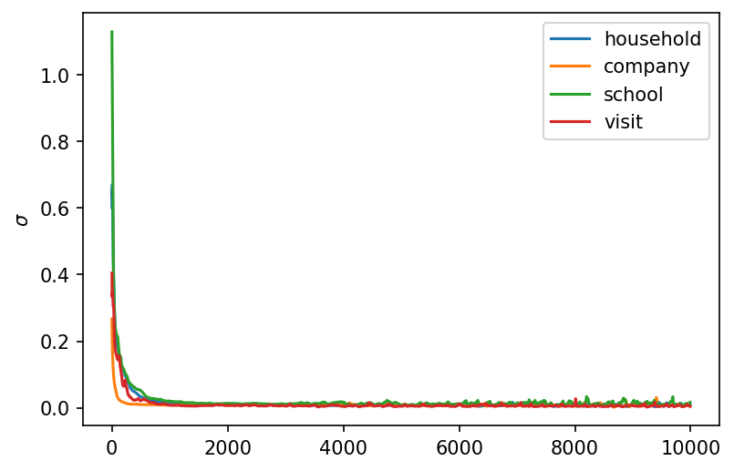
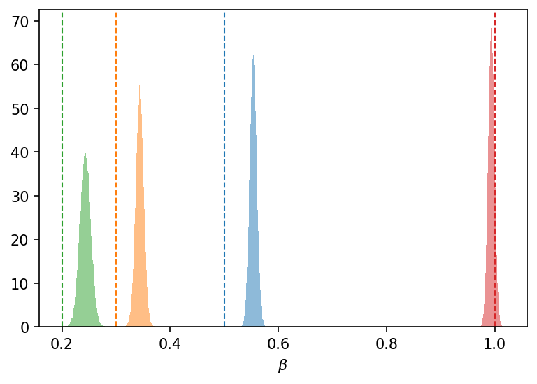

# Variational Inference

Here we describe how to do Variational Inference with TorchJune.

We again use the [Pyro](http://pyro.ai/) programming language to automate the complicated stuff for us.

An example configuration file can be found in `configs/svi.yaml`:

```yaml
title: SVI example configuration file.

device: "cpu"
june_configuration_file: "./configs/june.yaml"

results_path: "./svi_results"

inference_configuration:
  optimizer:
    type: Adam
    lr: 0.1
  n_steps: 10000
  loss:
    type: Trace_ELBO
    num_particles: 1

parameters_to_fit:
  infection_networks.networks.household.log_beta:
    prior:
      dist: Normal
      loc: 0.3
      scale: 0.1
  infection_networks.networks.company.log_beta:
    prior:
      dist: Normal
      loc: 0.1
      scale: 0.1
  infection_networks.networks.school.log_beta:
    prior:
      dist: Normal
      loc: 0.1
      scale: 0.1
  infection_networks.networks.visit.log_beta:
    prior:
      dist: Normal
      loc: 0.7
      scale: 0.1

emulator:
  use_emulator: false 
    #emulator_config_path: "./configs/emulator.yaml"
  emulator_path: "./data/emulator.pkl"

data:
  observable: 
    cases_per_timestep:
      time_stamps: [-1]
      error: 0.002
    
  observed_data: "./june_example/results.csv"
```

The interface is very similar to the [HMC]("./hmc.md") case, so most of the fields do not need explaining. The particularities of the SVI are specified under `inference_configuration`, where we specify the optimizer and the loss function to use.

We assume that the posterior distribution over the parameters is a Normal distribution, with parameters $\mu$ and $\sigma$. The values of $\mu$ and $\sigma$ are then found through an optimization problem, where we minimize the ELBO loss:



We can then plot the value of $\mu$ and $\sigma$ for each parameter over the training period:





And finally plot the posteriors:


